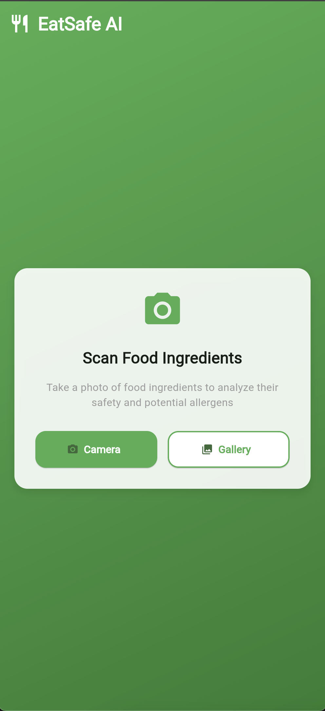
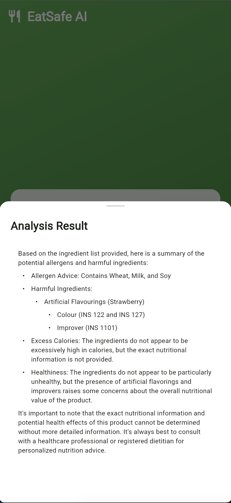

# 🥗 EatSafe AI

<div align="center">
  <h1 style="font-size: 58px; margin: 0;">🥗</h1>
  <h3>Analyze Food Ingredients for Safety and Health</h3>
  <p>A modern Flutter web application powered by AI to help you make informed decisions about your food</p>
  
  <p>
    <a href="https://eatsafe-ai.web.app" target="_blank">
      
    </a>
  </p>
  
  <p>Try it now: <a href="https://eatsafe-ai.web.app" target="_blank">https://eatsafe-ai.web.app</a></p>
</div>

## 🧠 AI Powered Analysis

EatSafe AI leverages the power of **Together Llama 3.2 Vision Model** to provide accurate and detailed analysis of food ingredients. This state-of-the-art multimodal model can:

- 🔍 Understand and analyze images of food ingredients
- 📝 Generate detailed safety assessments
- ⚠️ Identify potential allergens and harmful substances
- 🏥 Evaluate health implications and side effects
- 📊 Assess nutritional content and caloric values

## ✨ Features

- 📸 **Instant Analysis**: Take a photo or upload an image of food ingredients
- 🔍 **Smart Detection**: AI-powered ingredient analysis
- ⚠️ **Safety Alerts**: Identifies potential allergens and harmful ingredients
- 🏥 **Health Insights**: Provides information about side effects and health impacts
- 🍎 **Nutritional Info**: Evaluates caloric content and overall healthiness
- 💫 **Modern UI**: Beautiful, responsive interface with Material Design 3

## 🚀 Getting Started

1. **Prerequisites**
   - Flutter SDK (latest version)
   - Dart SDK
   - Web browser

2. **Installation**
   ```bash
   # Clone the repository
   git clone https://github.com/yourusername/eatsafe-ai.git

   # Navigate to project directory
   cd eatsafe-ai

   # Install dependencies
   flutter pub get

   # Run the app
   flutter run -d chrome
   ```

## 🎯 How to Use

1. Open the app in your web browser
2. Click either the "Camera" button to take a photo or "Gallery" to upload an existing image
3. Wait for the AI to analyze the ingredients
4. View the detailed analysis in the bottom sheet, including:
   - Safety assessment
   - Allergen warnings
   - Potential side effects
   - Caloric content
   - Health recommendations

## 🛠️ Technical Details

- Built with Flutter Web
- Uses Material Design 3 for modern UI
- Powered by Together Llama 3.2 Vision Model for advanced image analysis
- Hosted on Firebase for reliable performance
- Responsive design for all screen sizes
- Progressive Web App (PWA) support

## 📱 Screenshots

<div align="center">
  <table>
    <tr>
      <td></td>
      <td></td>
    </tr>
  </table>
</div>

## 🤝 Contributing

Contributions are welcome! Feel free to submit issues and pull requests.

## 📄 License

This project is licensed under the MIT License - see the [LICENSE](LICENSE) file for details.

## 🙏 Acknowledgments

- Flutter Team for the amazing framework
- Together AI for the powerful Llama 3.2 Vision Model
- Firebase for reliable hosting
- All contributors and users of EatSafe AI
